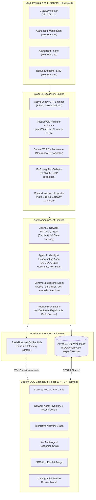

# NetSentinel
### Agentic Network Access Monitoring & Rogue Device Detection Platform

[](https://python.org)
[](https://fastapi.tiangolo.com)
[](https://react.dev)
[](https://www.typescriptlang.org)
[](https://sqlite.org)
[](https://tailwindcss.com)
[](LICENSE)

> **NetSentinel** is an enterprise-grade, software-based cybersecurity monitoring platform engineered to solve the fundamental network security question: *"What devices are on our network right now, which are authorized, and what changed?"*

Designed for SOC analysts, detection engineers, and network security architects, NetSentinel performs continuous passive and active network discovery, multi-vector device identity correlation, explainable additive risk scoring, and autonomous agent-driven investigation.

---

## 🏛️ System Architecture



---

## ✨ Key Capabilities & Engineering Invariants

### 1. Dual-Tier Non-Root Discovery
* **Active Scapy ARP Mode**: Broadcasts `Ether(dst="ff:ff:ff:ff:ff:ff") / ARP(pdst=<cidr>)` when running with elevated permissions (`sudo`).
* **Non-Root TCP Subnet Warming**: Concurrently sends lightweight TCP connect attempts across the calculated CIDR with 120ms timeouts. The operating system's kernel stack automatically broadcasts ARP requests to resolve each target MAC address, safely populating the local neighbor table without raw sockets.
* **OS Neighbor Cache Collection**: Safe subprocess queries across macOS (`arp -an`), Linux (`ip neigh` and `/proc/net/arp`), and Windows (`arp -a`).

### 2. Strict RFC 1918 Guardrails
* All scanning, probing, and indexing is strictly restricted to private subnets (`10.0.0.0/8`, `172.16.0.0/12`, `192.168.0.0/16`, `127.0.0.1/32`).
* Public and external IP addresses are discarded at the boundary to guarantee zero unauthorized external probing.

### 3. Truth-First / Zero-Fabrication Philosophy
* **Never fabricates identities**: If a hostname cannot be resolved via reverse DNS or mDNS, it is explicitly recorded as `"Unknown"` rather than inventing fake product names.
* **Locally Administered Address (LAA) Detection**: Evaluates IEEE 802 U/L bit (`mac_first_octet & 0x02 != 0`) to distinguish randomized/private MACs from manufacturer-assigned hardware OUIs.
* **Local Offline IEEE OUI Database**: Embedded lookup of 100+ hardware vendors without querying third-party cloud APIs.

### 4. Deterministic, Explainable Risk Scoring (No LLM in Critical Path)
Risk scores (0–100) are computed mathematically via transparent, auditable rules:
* `RISK-NEW-UNKNOWN`: **+25** (Device not in baseline)
* `RISK-OFF-HOURS`: **+20** (First appeared outside baseline hours)
* `RISK-SMB-EXPOSED`: **+20** (Exposed SMB on unauthorized client)
* `RISK-RANDOM-MAC`: **+15** (Uses randomized MAC address)
* `RISK-IP-CONFLICT`: **+35** (Multiple MACs claiming one IP)
* `MIT-TRUSTED-VERIFIED`: **-30** (Operator verified device as TRUSTED)

### 5. Persistent Identity & Churn Ledger
Tracks full historical relationships:
* **Address History**: Records every IP address (IPv4 and IPv6) and MAC address historically associated with an endpoint.
* **Identity Mutation Ledger**: Records changes in hostnames, NetBIOS names, and OS fingerprints over time.
* **Classification Persistence**: Operator trust classifications (`TRUSTED`, `UNKNOWN`, `GUEST`, `SUSPICIOUS`, `BLOCKLISTED`) are preserved across re-scans.

---

## 🛠️ Technology Stack

| Layer | Technologies | Key Libraries & Specifications |
|---|---|---|
| **Backend Core** | Python 3.12, FastAPI, Uvicorn | `fastapi`, `uvicorn[standard]`, `pydantic v2`, `psutil` |
| **Network Discovery** | Scapy 2.7, Raw Sockets, BSD Sockets | `scapy`, `asyncio`, RFC 826 (ARP), RFC 4861 (NDP), RFC 1918 |
| **Database & ORM** | Async SQLite WAL Mode, SQLAlchemy 2.0 | `sqlalchemy[asyncio]`, `aiosqlite`, `greenlet` |
| **Testing** | Pytest, AnyIO, HTTPX | `pytest`, `pytest-asyncio`, `httpx` (51 automated tests) |
| **Frontend UI** | React 18, TypeScript, Vite 5 | `react`, `react-dom`, `@types/react`, `lucide-react` |
| **Styling & Theme** | Tailwind CSS 3.4, PostCSS | Custom dark cybersecurity SOC theme (`#090D16`), custom typography |

---

## 📁 Repository Structure

```
netsentinel/
├── backend/
│   ├── app/
│   │   ├── main.py                     # FastAPI application bootstrap & lifespan
│   │   ├── core/
│   │   │   ├── database.py             # SQLAlchemy async engine, WAL pragma & RFC 1918 validator
│   │   │   ├── oui_database.py         # IEEE OUI database, MAC normalizer & LAA checker
│   │   │   ├── seed_data.py            # Baseline device inventory & sample incident seed
│   │   │   └── websocket_hub.py        # Central pub/sub WebSocket broadcaster
│   │   ├── models/                     # 10 SQLAlchemy ORM Domain Models
│   │   │   ├── device.py               # Central Device asset model & enums
│   │   │   ├── address.py              # Historical IP/MAC associations
│   │   │   ├── identity.py             # Hostname mutation & OS fingerprint ledger
│   │   │   ├── service.py              # Exposed TCP/UDP ports & banner grab records
│   │   │   ├── baseline.py             # Behavioral active hours & port profiles
│   │   │   ├── alert.py                # Security alert records with deduplication
│   │   │   ├── risk.py                 # Historical risk score calculations with factor logs
│   │   │   ├── incident.py             # Security incident records with SHA-256 evidence
│   │   │   ├── evidence.py             # Forensic evidence packages
│   │   │   └── audit.py                # Cryptographically hashed operator audit log
│   │   ├── discovery/                  # Real Multi-Vector Network Discovery Engine
│   │   │   ├── route_inspector.py      # Dynamic active interface, CIDR & gateway calculator
│   │   │   ├── arp_scanner.py          # Active Scapy Layer 2 ARP broadcast engine
│   │   │   ├── arp_collector.py        # Cross-platform OS neighbor cache reader
│   │   │   ├── ndp_collector.py        # IPv6 Neighbor Discovery (NDP) collector
│   │   │   ├── reachability.py         # Subnet TCP ARP cache warmer & port reachability
│   │   │   ├── hostname_resolver.py    # Safe reverse DNS & mDNS resolution
│   │   │   ├── port_scanner.py         # Low-noise async TCP connect port scanner
│   │   │   ├── fingerprinter.py        # Safe OS & device-type fingerprinting engine
│   │   │   └── discovery_engine.py     # Unified discovery sweep orchestrator
│   │   ├── agents/                     # Autonomous Security Intelligence Agents
│   │   │   ├── discovery_agent.py      # Layer 2/3 enrollment, correlation & state tracking
│   │   │   └── identity_agent.py       # Port probing, fingerprinting & identity enrichment
│   │   ├── api/                        # REST API Controllers
│   │   │   ├── devices.py              # Inventory CRUD, classification & history endpoints
│   │   │   ├── discovery.py            # Interface detection & discovery sweep triggers
│   │   │   ├── enrichment.py           # Identity Agent enrichment endpoints
│   │   │   ├── alerts.py               # Alert acknowledgment & triage endpoints
│   │   │   ├── posture.py              # Executive security posture metrics
│   │   │   ├── incidents.py            # Security incident management
│   │   │   └── websocket.py            # WebSocket live telemetry streaming endpoint
│   │   └── schemas/                    # Pydantic v2 Request/Response Contracts
│   │       ├── device.py
│   │       └── common.py
│   ├── tests/                          # Complete Automated Pytest Suite (51 Tests)
│   │   ├── conftest.py                 # Async DB isolation fixture
│   │   ├── test_phase1.py              # Architecture, database & API tests
│   │   ├── test_phase2_discovery.py    # ARP/NDP parsing & type inference tests
│   │   ├── test_phase3_identity.py     # Port scan, fingerprinting & history tests
│   │   └── test_real_discovery.py      # Real network detection, Scapy, LAA & merging tests
│   └── run.sh                          # Backend startup script
├── frontend/
│   ├── src/
│   │   ├── App.tsx                     # Top-level SOC dashboard orchestrator
│   │   ├── types.ts                    # TypeScript domain interfaces
│   │   ├── components/
│   │   │   ├── Navbar.tsx              # Global header, threat gauge & PROBE NETWORK button
│   │   │   ├── SecurityPostureCards.tsx# Executive KPI metrics (Connected, Trusted, Rogue, Alerts)
│   │   │   ├── DeviceTable.tsx         # Filterable asset inventory with dynamic online indicators
│   │   │   ├── NetworkTopologyView.tsx # Interactive SVG/Canvas node graph of local subnet
│   │   │   ├── AgentActivityPipeline.tsx# Visual telemetry pipeline showing agent reasoning
│   │   │   ├── LiveAlertFeed.tsx       # Real-time alert triage banner
│   │   │   └── DeviceDossierModal.tsx  # Deep forensic inspection modal with tabbed views
│   │   └── lib/
│   │       └── api.ts                  # Typed REST API client
│   ├── package.json
│   ├── vite.config.ts
│   └── run.sh                          # Frontend startup script
├── start.sh                            # One-command dual-server launcher
├── README.md                           # Documentation & portfolio showcase
└── .gitignore
```

---

## 🚀 Quickstart & Installation

### Prerequisites
* Python 3.11+
* Node.js v18+ and npm

### 1. Clone the Repository
```bash
git clone https://github.com/your-username/netsentinel.git
cd netsentinel
```

### 2. Backend Setup
```bash
cd backend
python3 -m venv .venv
source .venv/bin/activate
pip install -r requirements.txt # (or fastapi uvicorn sqlalchemy aiosqlite pydantic psutil scapy httpx pytest pytest-asyncio)
```

### 3. Frontend Setup
```bash
cd ../frontend
npm install
```

### 4. Run Both Servers
```bash
# From the project root:
chmod +x start.sh
./start.sh
```

* **SOC Web Dashboard**: [http://127.0.0.1:3000](http://127.0.0.1:3000)
* **REST API Documentation (Swagger)**: [http://127.0.0.1:8000/docs](http://127.0.0.1:8000/docs)
* **API Health Endpoint**: [http://127.0.0.1:8000/health](http://127.0.0.1:8000/health)

---

## 📡 Key REST API Endpoints

| Method | Endpoint | Description |
|---|---|---|
| `GET` | `/api/network/interface` | Returns auto-detected active interface, IP, gateway, CIDR, netmask |
| `POST` | `/api/network/discover` | Triggers immediate multi-vector Layer 2/3 network sweep |
| `GET` | `/api/devices` | Returns monitored asset inventory with eager-loaded services/identities |
| `GET` | `/api/devices/online` | Returns only currently active online endpoints |
| `GET` | `/api/devices/{id}` | Returns single device forensic dossier |
| `GET` | `/api/devices/{id}/history`| Returns complete persistent ledger of all IPs, hostnames, and MACs |
| `POST` | `/api/devices/{id}/classify` | Re-classifies device (`TRUSTED`, `SUSPICIOUS`, etc.) and recalculates risk |
| `GET` | `/api/posture` | Executive security posture summary statistics |
| `GET` | `/api/alerts` | Active and historical security alerts |
| `POST` | `/api/enrichment/run` | Triggers Agent 2 fingerprinting and port scan |
| `WS` | `/ws/events` | Real-time bi-directional security telemetry stream |

---

## 🧪 Testing & Quality Assurance

Run the automated test suite:
```bash
cd backend
PYTHONPATH=. pytest -v tests/
```

Test coverage includes:
* **Interface & Subnet Detection**: Validates CIDR math and gateway correlation.
* **Cross-Platform Neighbor Parsing**: BSD/macOS `arp -an`, Linux `ip neigh`, Windows `arp -a`.
* **MAC Normalization**: Validates BSD single-digit padding (e.g. `20:c:86` → `20:0c:86:20:9b:da`).
* **LAA Randomized MAC Detection**: Mathematical verification of bit 1 in byte 0.
* **Identity Mutation Tracking**: Hostname changes create new audit records without duplicate device IDs.
* **Trusted Device Persistence**: Verifies that human classification decisions are preserved across scans.
* **Offline Device State Transitions**: Verifies endpoints absent from subsequent sweeps transition to `OFFLINE`.

---

## 💡 Technical Interview Q&A (Cybersecurity & SOC Engineering)

### Q1: Why use ARP discovery instead of ICMP ping sweeps?
> **Answer**: Most modern client operating systems (Windows 10/11 with Windows Defender Firewall, macOS stealth mode, iOS devices) drop unsolicited ICMP echo requests by default. However, to communicate on an Ethernet or Wi-Fi local broadcast domain, **every host must respond to ARP requests** to resolve its Layer 2 hardware address. NetSentinel uses active ARP broadcast frames and passive neighbor cache inspection as primary discovery signals, ensuring stealth devices are accurately indexed.

### Q2: How does NetSentinel discover devices on Wi-Fi without root/administrator privileges?
> **Answer**: Active Layer 2 packet crafting (via Scapy or BPF) typically requires elevated capabilities (`CAP_NET_RAW` or root). NetSentinel provides an innovative fallback: it concurrently initiates non-blocking TCP connect attempts to common ports across the detected `/24` subnet. Even when connections fail or time out, the host operating system's kernel stack must automatically emit Layer 2 ARP requests to resolve each target IP, populating the OS kernel ARP table. NetSentinel then reads the freshly populated kernel ARP cache via `arp -an`.

### Q3: How do you handle MAC address randomization (Private Wi-Fi Addresses)?
> **Answer**: Modern iOS, Android, and Windows clients randomize their MAC addresses per SSID to prevent tracking. NetSentinel evaluates the IEEE 802 Locally Administered Address (LAA) bit (`byte 0, bit 1`). If the bit is set, NetSentinel tags the device with a `Randomized / Locally Administered MAC` indicator and applies a moderate risk delta (`+15`), but does **not** automatically mark it as malicious. Correlation agents utilize secondary signals (mDNS hostnames, exposed services, and IP churn) to track the endpoint consistently.

---

## 📄 License
This project is licensed under the MIT License — see the [LICENSE](LICENSE) file for details.
